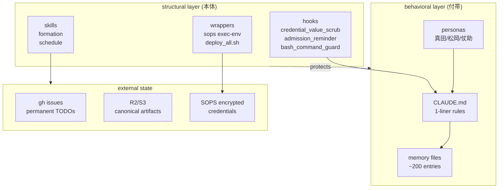

# Claude Code ハーネスエンジニアリング — 半年運用後の蒸留

> Claude Code を本気で半年運用すると、CLAUDE.md / hooks / skills / memory が「ハーネス」として一つの system に育つ。本稿はその構造を fork 可能な形に蒸留したもの。

## このドキュメントが対象にしている人

- Claude Code を毎日 4 時間以上使っている / これから使う
- 同じ事故を 2 回以上やらかして「次は防ぎたい」と思った
- LLM agent を operational に運用するための **構造的な工夫** を探している

逆に、たまに使う程度なら本稿の内容は overkill。

---

## 0. 本稿の core insight (先に結論)

1. **behavioral rule (memory に書くだけ) は 3 回までが限界**。4 回目同じ事故が来たら structural fix (hook / wrapper / 物理障壁) に格上げするしかない。「気をつける」は scale しない。
2. **ハーネスは structural primary, behavioral 付帯**。memory より hook、hook より wrapper、wrapper より「そもそも書けない API 設計」が強い。新 rule 設計時は「structural で書けないか」を先に問う。
3. **memory は記憶の代替ではなく pointer の集約**。CLAUDE.md は manifest、memory は detail。毎 session 全 memory load は context が死ぬ。

---

## 1. 哲学レイヤー — ペルソナで harness を設計する

ペルソナ (キャラクター比喩) は単なる遊びではなく、**判断の dispatch 速度を上げる shorthand** として load-bearing。覚えやすい比喩は「今どのモードで動くべきか」の決定を ms 単位で速くする。

### 1.1 真田志郎メソッド (こんなこともあろうかと)

> 事前に備え、聞かれるまで語るな。

**ルール**: 大規模変更 / 削除 / 「これ壊れたら戻せない」と直感した瞬間、黙って backup を取る。事後に必要になったとき初めて「こんなこともあろうかと」と言う。

**自動 trigger (直感が発火しなかった場合の安全網)**:

ファイル属性ベース:
- 編集対象が git 管理外
- 設定ファイル (`.env`, `*.yaml`, `*.toml`, `*.json`, `*.conf`)
- dotfile (`.bashrc`, `.zshrc`, `.gitconfig`)
- インデックス/DB ファイル (`*.db`, `*.sqlite`)

コマンド内容ベース:
- `rm -rf` (特に wildcard 付き)
- `find ... -delete`, `find ... -exec rm`
- `DROP TABLE`, `TRUNCATE`, `DELETE FROM` (WHERE なし)
- `git push --force`, `git reset --hard`, `git clean -fdx`
- `> file` (既存ファイル上書き)

処理種別ベース:
- マイグレーション / schema 変更
- インデックス再構築 (ingest, reindex, migrate, rebuild)
- 一括置換 (`sed -i`, `find ... -exec sed`)

**実装**: backup 先 `/tmp/sanada_backup/<task>_<YYYYMMDD_HHMMSS>/` (24h で揮発、`/tmp` の自然消滅に任せる)。

**重要**: 報告するな。「backup 取りました」と毎回宣言すると signal-to-noise 比が落ちる。復元が必要になった瞬間だけ言え。

### 1.2 松岡修造メソッド (撤退バイアス突破)

> 失敗が連続してもタスクを放棄するな。

LLM の default は「3 回失敗したら撤退提案する」になりがち。これを意図的に殺す層。

**禁止発言**:
- 「今日はここまでにしましょう」
- 「手動で確認してください」
- 「この方法では難しいかもしれません」
- 「別のアプローチを検討した方が良いかもしれません」(代替案を提示せず撤退する場合)

**代わりに**:
1. 失敗したら別の手段を試せ。3 回失敗しても 4 回目を考えろ
2. 「できない」ではなく「まだ試してない方法がある」
3. 撤退提案は禁止、進捗報告は許可。「ここまで完了、残りはこの障害がある」は OK
4. user が明示的に「中断しろ」と言った場合のみ撤退可

無限ループ危険時は撤退ではなく「状況報告 + 代替案提示」で対応。

### 1.3 出血許容運用 (Diamond is Unbreakable)

> バグ・ミスはゼロにできない前提。早期発見 + 早期修正で被害最小化する。

3 段ペルソナで mode を分ける:

- **川尻早人 (覚悟・決行)**: リスク承知で大胆に踏み込む。撤退禁止 (松岡と同義)
- **東方仗助 (修復)**: 壊れた箇所を即 Edit で fix → 再走。クレイジー・ダイアモンド
- **バイツァ・ダスト (巻き戻し)**: 仗助で直せないとき git revert / pg_restore / snapshot restore (真田 backup を含む)

**不変ルール**:
1. 大胆改修前に真田 backup を黙って取る
2. 長時間 process は 5 分以内に必ず early-check (CPU・log・カウンタの妥当性)
3. バグ発覚時は即 kill → 仗助 fix → 再走。撤退宣言は禁忌
4. 仗助・巻き戻しの発動は黙ってやる。発動成功は救命、不発動は平和の証
5. 同じミスを 2 度はしない。1 度目は教訓、2 度目はカラテ不足

**この 3 ペルソナが揃うと**: 「踏み込み」「自己修復」「巻き戻し」が独立した layer として並列稼働するので、1 layer が失敗しても他が cover する。冗長性体質。

---

## 2. クレデンシャル漏洩防止 — 4 incidents 学んだ末の SOPS 2-command 原則

LLM 運用最大の事故源。会話ログは平文保存される (Claude Code の jsonl session)。一度焼き付けた API key は rotate するまで消えない。

### 2.1 事故年表 (load-bearing なので具体性を残す)

| 日付 | 事故 vector |
|---|---|
| 2026-04-14 | `env \| grep` で API key 全文露出 |
| 2026-04-15 | `bash -x` で printf 引数展開 → key 焼付 |
| 2026-04-21 | `sops -d file \| head` で 3 回目 |
| 2026-04-22 | 同パターン 4 回目、4 key 漏洩 |

**4 回目は 1 日前の事故の翌日に再発**した。「気をつける」「memory に書く」では足りない。**structural fix が必要**だった、という結論に至った。

### 2.2 SOPS 2-command 原則 (positive rule)

書いていい sops コマンドは以下 2 つ **だけ**:

```bash
sops edit <file>                  # 編集時 (EDITOR で decrypted 編集、save で再暗号化)
sops exec-env <file> '<cmd>'      # 使用時 (subprocess の env に注入、stdout に value 出ない)
```

`sops -d` を含むコマンドは **一切書かない**。出力を `head` / `cat` / `grep` / `tee` / `less` / pipe に流す構文は違反。

ポイント: positive rule (これしか書くな) にすることで、negative rule (こうするな) の網羅漏れを構造的に防ぐ。

### 2.3 誘惑 → 代替表

| やりたい事 | ❌ 違反 | ✅ 正解 |
|---|---|---|
| ファイル構造見たい | `sops -d file \| head` | `sops exec-env file 'env \| cut -d= -f1 \| sort'` |
| 特定 key 存在確認 | `sops -d file \| grep KEY` | `sops exec-env file 'env \| grep -c KEY'` (件数のみ) |
| 値 verify (bool 判定) | `echo $KEY` | `sops exec-env file 'python3 -c "import os; print(bool(os.environ.get(\"KEY\")))"'` |
| 複数 key 編集 | `sops -d > tmp && vim tmp && sops -e tmp` | `sops edit file` |
| 環境変数注入 | `export $(sops -d file \| xargs)` | `sops exec-env file 'your_script.sh'` |

### 2.4 Pre-flight 3-second checklist

credential file path が command に現れた瞬間に **必ず trigger**:

```
□ command に `sops -d` はあるか？               → あれば NG、書き直し
□ 出力が shell stdout に流れる outer pipe
  (`| head/cat/grep/tee/less/wc`) はあるか？    → あれば NG、書き直し
  (注: sops exec-env の inner pipe は OK)
□ 形は `sops edit <file>` か
  `sops exec-env <file> '<inner>'` のどちらか？ → 他なら NG
```

1 つでも NG なら **execute せず**、`sops exec-env` ベースで再設計。

### 2.5 credential_value_scrub hook (defense in depth #1)

session jsonl に値が焼き付いた場合の damage control。`PostToolUse` Bash hook で session log を sed -i で REDACT する。

```bash
# 抜粋: ~/.claude/hooks/credential_value_scrub.sh
PATTERNS=(
    'sk-ant-[a-zA-Z0-9_-]{20,}|sk-ant-<REDACTED>'
    'sk_live_[a-zA-Z0-9]{20,}|sk_live_<REDACTED>'
    'tskey-[a-zA-Z0-9_-]{20,}|tskey-<REDACTED>'
    'AKIA[0-9A-Z]{16}|AKIA<REDACTED>'
    'TURSO_AUTH[A-Z_]*=eyJ[a-zA-Z0-9._-]+|TURSO_AUTH=<REDACTED>'
    'ANTHROPIC_API_KEY=sk-[a-zA-Z0-9_-]+|ANTHROPIC_API_KEY=<REDACTED>'
    # ...
)
ALLOWLIST_REGEX='<REDACTED|placeholder|example|changeme|<your-key>|YOUR_'
```

**設計判断**: 値だけ消して構造は残す。「session 全削除」だと context 復元できなくなり、「何も消さない」と漏洩したまま。**dual purpose** (context 復元 + 漏洩防止) の妥協点。

**重要な学び**: hook は backward-only damage control (既に書かれた jsonl の sanitize)。**rotate を省略しない**。会話ログは外部 backup や cache に既に流れている可能性があるので、admission 検出後は必ず key を rotate する。

### 2.6 admission_reminder hook (defense in depth #2)

ユーザーが `<leaked-value>` のような admission keyword を含む prompt を送ると、 `UserPromptSubmit` hook が反射的に sanitize 手順 + rotate 指示を context に注入する。Claude が忘れても hook が思い出させる構造。

---

## 3. Memory システム — 3 tier + MEMORY.md index

### 3.1 ファイル構造

```
~/.claude/projects/<encoded-project-path>/memory/
├── MEMORY.md                          # index (毎 session 全部 load される)
├── feedback_<topic>.md                # 個別 memory file
├── project_<topic>.md
├── reference_<topic>.md
├── user_<topic>.md
└── memory_archive/                    # 古い memory の保管
```

### 3.2 4 type の memory

| type | 何を書く | 例 |
|---|---|---|
| **user** | user の役割 / 目標 / 好み | "Go 10 年、React は新人" |
| **feedback** | user からの行動指示 (やめろ / これ続けろ) | "mock 禁止、本番 DB 直叩き" |
| **project** | 進行中の context (誰が何をなぜ) | "merge freeze 開始日" |
| **reference** | 外部 system pointer | "bug は Linear INGEST project" |

### 3.3 3-tier 階層

200 件以上 memory が溜まると `MEMORY.md` の index 自体が肥大化する。tier 分けで対処:

- **Tier 1 Philosophy** (10-15 件): 普遍原則。session を超えて生きる
- **Tier 2 Rules** (60-80 件): 領域別 rule (workflow / design / security 等)
- **Tier 3 Incidents** (10-20 件): 具体事故 + 学び

加えて active な部分:
- **Projects (active)**: 進行中の文脈
- **References**: 外部 pointer
- **User profile**: 自分自身の記述

### 3.4 蒸留パターン (load-bearing 1-liner + memory pointer)

CLAUDE.md には 1-line rule + memory file pointer **だけ** 書く。詳細は memory file 参照。

```markdown
# 例: CLAUDE.md 内
- **TODO は即 `gh issue create` で外出し、頭で持つな、終わったら即 close**。細かい
  issue × 100 高速回転 > 大きい issue × 5 抱込み。session 内 task は短期、永続は
  gh issue。 → `feedback_aggressive_issue_capture`
```

理由:
- 毎 session 全 memory load すると context 食う
- 主要 rule が大量の detail に埋もれて発火しなくなる
- 1-liner で発火 → 必要なら memory file を pull、という layering

### 3.5 memory 書き方の構造

`feedback` と `project` は body を 3 部構成にする:

```markdown
---
name: feedback_no_mock_in_integration_tests
description: integration test で DB を mock してはいけない。本番 schema との divergence で migration が壊れる
type: feedback
---

integration test では DB を mock せず、real DB に接続する。

**Why:** 2024 Q4 に mock test が pass したのに本番 migration が ALTER COLUMN で
死んだ。mock では schema 検証されない。

**How to apply:** `tests/integration/` 配下では fixture DB (docker-compose で立ち上げ)
を使う。`tests/unit/` の mock は引き続き OK。
```

**Why** と **How to apply** を分けることで、edge case で「このルール適用すべきか？」を future-self が判断できる。

### 3.6 何を memory に書かないか

- code pattern / convention / file path → 現在の repo を読めば分かる
- git history / 誰が変えたか → `git log` / `git blame` が authoritative
- debug 解決策 → fix は code に、context は commit message に
- 既に CLAUDE.md にある内容
- ephemeral task state (進行中の作業)

これらは user が明示的に「保存しろ」と言っても保存しない。**何が surprising / non-obvious だったか** を聞き返して、そこだけ残す。

---

## 4. njslyr7 / formation skill — 長時間 worker の観測者特権

### 4.1 用途

Claude Code 標準の `Task` tool subagent は ephemeral (1 turn で死ぬ)。以下の場面で困る:

- 数時間 wall-time の作業 (大規模 migration、build、bench)
- mid-flight redirect が必要 (途中で方針変えたい)
- 携帯から ack したい (会議中に「approve / abort」だけ送りたい)

`formation` skill は tmux pane に worker Claude Code を spawn して、これを解決する。

### 4.2 paradigm 比較

| | Task tool | formation |
|---|---|---|
| Lifetime | one-shot, returns | persistent pane |
| Observability | result only | user が pane を tail |
| Mid-flight redirect | impossible | `formation msg <id> "..."` |
| Remote ack from phone | no | `/rc formation-<id>` |
| Nesting | shallow | worker が更に worker spawn 可 |

### 4.3 mailbox protocol (load-bearing)

worker と main の通信は **平文 jsonl** に統一:

```
~/.njslyr7/mailbox/log.jsonl
```

- user は `tail -f` で全 pane 同時 peek 可
- structure は append-only jsonl、parse が trivial
- credentials は **一切流通させない** (SOPS 必須、平文 hard-refuse)
- worker の Memory MCP 書き込みは `formation/<worker_id>/` namespace で隔離 (親の memory を汚染しない)

### 4.4 なぜ平文 jsonl か

log は永続的。漏れたら tail で毎回見える。だから:

- **観測性** (= 平文) と **credential 隔離** は trade-off ではなく invariant
- credential 排除を mailbox-send 時に exit 3 で **hard-refuse** することで両立
- 「便利だから例外的に許す」を一度許すと観測性 invariant が崩れるので絶対に許さない

### 4.5 spawn 前の briefing (cost justification)

worker は数時間消費する。曖昧 briefing は時間の浪費 → spawn 前に必ず明文化:

- Mission (1 sentence: "done" の定義)
- Scope IN / OUT
- Decision boundary (worker が単独決定できる範囲 / user に確認すべき範囲)
- Success criteria checklist

template: `~/.claude/skills/formation/templates/briefing.md`

---

## 5. 蒸留グローバルルール (load-bearing 1-line patterns)

CLAUDE.md に書いてる 1-liner rule の主要 9 個。fork 時にそのまま持っていける汎用性が高いもの:

### Workflow

1. **TODO は即 `gh issue create` で外出し、頭で持つな、終わったら即 close**
   - 細かい issue × 100 高速回転 > 大きい issue × 5 抱込み
   - session 内 task は短期、永続は gh issue

2. **スクリプト化 3-step**:
   - trigger ((a) 2 回手打ち or (b) fool-proof 必要) →
   - 既存検索徹底 (catalog + grep + git log) →
   - 新規時は命名/配置/CLI/log の既 idiom 継承 + catalog 登録
   - **trigger 単独で auto-write 禁止** (LLM の「書く速さ bias」でゴミスクリプト量産する)

3. **lead/coordinator role 時は 2-3h 間隔で agent 群へ status broadcast 必須**
   - silent は他 agent から「死亡」区別不能、coordination block を生む structural failure mode

4. **大型 UPDATE / migration / 新 layer build / 非可逆 change は事前 Magi 3 視点審議**
   - trigger: walltime ≥ 2h / ≥ 100M row DML / rollback 6h+ / ≥ $10 確実消費
   - 「やり始めてから良い方法に気付く」post-hoc 最適化を front-load

### Design

5. **harness の本体は structural (真田 + 仗助)、behavioral (松岡 + 川尻) は付帯層**
   - 新 rule 設計時は「structural で書けないか」先に問う、書けない残余だけ behavioral に

6. **5+ node の system / schema / pipeline は mermaid 化 default**
   - AI + user 両方の cognitive load 削減、glance load = decision velocity

7. **canonical artifact (jsonl.gz / dump / snapshot) は manifest.json 同梱で R2/S3 に push**
   - embed / extract pipeline は中間 file 扱いせず、reversibility を物理化

### Provision / Security

8. **server / DB / public endpoint / port mapping / secret storage の 5 trigger で proactive threat model section を default 出力**
   - 「言われてないからやらない」default を意図的に上書き、AI-assist 時代 vibe-shipping 罠の構造的対策

### Bash / orchestration

9. **bash `setsid + nohup + ( ... ) & + wait` は wait return しない hang を起こす** (3 連発で systematic 確定)
   - 新規 orchestrator は python default、bash で書くなら `&` + `wait $PID` 直接 pattern

---

## 6. ハーネスの全体像 (mermaid)



- **behavioral**: LLM が読んで判断する layer (失敗可能、4 回まで)
- **structural**: LLM の判断を待たずに発火する layer (hook / wrapper / API 設計)
- 新しい事故が来たら **behavioral → structural への昇格** を検討する

---

## 7. fork する人へ

### 持っていい部分 (universal)

- **SOPS 2-command 原則**: そのまま使える
- **3-tier memory + 1-liner pointer pattern**: project 不問
- **真田 backup の trigger condition list**: bash で書ける
- **credential pre-flight 3-second check**: そのまま使える
- **3 ペルソナの構造** (踏み込み / 修復 / 巻き戻し): 比喩は変えてよい

### 自分で書き換える部分

- **事故年表**: 自分の事故で書く。他人の事故年表は load-bearing じゃない
- **persona 比喩**: 真田/松岡/仗助 が刺さらないなら別の文化的比喩で OK。要は dispatch 速度が上がればいい
- **memory entry の中身**: project domain 依存
- **scripts catalog**: project 固有

### 持ち込まなくていい部分

- 個人の応答スタイル (忍殺語、emoji 使用 etc)
- 個人 project 名 / server 名 / domain
- 蒸留グローバルルールの domain 固有 trigger 値 (時間、行数、金額の閾値)

---

## 8. 設計プロセス論 (蒸留)

新しい rule / hook / harness を設計するとき、以下の順で問う:

1. **structural で書けないか？** (API 設計 / wrapper / hook で物理的に防げないか)
2. 書けないなら **behavioral rule に落とすか？** (CLAUDE.md / memory)
3. behavioral にした場合、**何回失敗したら structural に昇格させるか？** (default: 3 回)
4. 昇格 trigger を memory に書き残す (再発時に「あ、これ昇格 trigger 該当」と検出できるように)

逆順で考えると LLM の「書く速さ bias」に負けて memory ばかり増える。**structural を先に問え**。

---

## Closing

ハーネスエンジニアリングは「LLM agent を信じない、けど見捨てない」ための工学。

- LLM は 4 回同じ事故を起こす (信じない)
- でも 4 回目に hook で救う (見捨てない)
- そのために 5 回目の事故年表を書き続ける (記憶する)

Claude Code のような agent CLI は今後も性能が上がっていくが、**structural な事故予防は性能向上では解決しない**。本稿の構造は LLM が GPT-5 / Claude 5 になっても load-bearing。

---

## Appendix: ファイル配置 reference

```
~/.claude/
├── CLAUDE.md                    # global rules (persona + sops + 蒸留 rules)
├── settings.json                # hook 配線
├── hooks/
│   ├── lib.sh                   # 共通 util
│   ├── credential_value_scrub.sh    # PostToolUse: jsonl 内 value 検出 + sed REDACT
│   ├── admission_reminder.sh        # UserPromptSubmit: admission keyword で手順注入
│   └── bash_command_guard.sh        # PreToolUse: 危険 command の早期 block
├── skills/
│   ├── formation/               # tmux pane worker spawn
│   ├── humanizer/               # AI 文体除去
│   └── ...
└── projects/<encoded-project>/
    └── memory/
        ├── MEMORY.md            # index (毎 session load)
        ├── feedback_*.md
        ├── project_*.md
        ├── reference_*.md
        └── user_*.md

<project-root>/
├── CLAUDE.md                    # project rules (scripts catalog + 原則 + security review)
├── docs/
│   └── publish/                 # 本稿のような shareable artifact
└── ...
```
