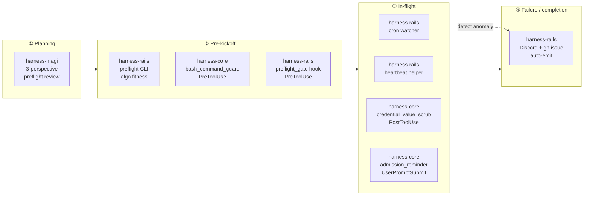

# claude-harness — architecture, status, roadmap

> One-stop project overview: current architecture, what's shipping, open work, and where this is going. Per-plugin detail lives in each plugin's README; this doc is the **cross-cutting view**.

Last updated: 2026-05-01.

---

## 1. Architecture

### Three plugins, three workflow phases



Each plugin owns one workflow phase, with a small overlap at the boundaries:

| Phase | Question being answered | Plugins responsible |
|---|---|---|
| Planning | "Should we do this in this form?" | harness-magi |
| Pre-kickoff | "Will this fit / is the command safe?" | harness-rails preflight, harness-core bash guard, harness-rails preflight_gate |
| In-flight | "Is it diverging from plan?" | harness-rails heartbeat+watcher, harness-core scrub+reminder |
| Failure / completion | "Notify, don't auto-correct" | harness-rails emit |

### Composition rules

- **Independent**: no plugin requires another. Install whichever subset matches your risk surface.
- **Layered**: each plugin maps to a different level of the 4-level rail model below — they're not redundant, they're complementary.
- **Graceful degrade**: missing tools (Discord, gh, Task) cause a plugin to silently skip its dependent feature, not crash.

### 4-level rail model

> Detailed in [`PHILOSOPHY_RAIL_LEVELS.md`](./PHILOSOPHY_RAIL_LEVELS.md). Summarized here for cross-reference.

```
level 1   memory.md / CLAUDE.md note      "be careful about X"
level 2   protocol step in CLAUDE.md      "in step N, check X"
level 3   inline check in script          if (X is true) { warn() }
level 4   external rail (cron / hook)     watcher pings the script's state
```

Mapping plugin components to levels:

| Component | Level | Why this level |
|---|---|---|
| harness-core hooks (3) | 4 | Hook fires regardless of agent attention |
| harness-magi skill | 2 | Invoked when the operator (or CLAUDE.md trigger) calls it |
| harness-rails preflight CLI | 3 | Inline check inside the operator's script |
| harness-rails heartbeat helper | 3 | Inline write inside the long-running job |
| harness-rails cron watcher | 4 | External; fires even if the job is silent / dead |
| harness-rails preflight_gate hook | 4 | PreToolUse blocks before the dangerous bash runs |

The lesson from the 23h HNSW incident ([INCIDENT_23H_HNSW.md](./INCIDENT_23H_HNSW.md)): **level 1-2 alone is insufficient for long-running ops**. By hour 8, the agent has forgotten the principle written in memory 8 hours ago. Level 3-4 is what catches the silent drift.

---

## 2. Status

### Currently shipping

| Plugin | Version | Components | Real-world validation |
|---|---|---|---|
| **harness-core** | v1.0 | 3 hooks (bash_command_guard, credential_value_scrub, admission_reminder) | 6+ months daily use; 8+ credential leak incidents prevented; one false-positive (issue #1) caught and fixed before public release |
| **harness-magi** | v0.1 | 1 skill, 3 persona templates | Pure-prompt skill; production trigger conditions ported from `feedback_magi_preflight_for_major_updates` memory |
| **harness-rails** | v1.0 | 4 components (preflight CLI, heartbeat helper, cron watcher, preflight_gate hook) | 165M-row HNSW build prevented re-occurrence of 23h incident; 12-bug cascade incident motivated 5 trigger patterns in preflight_gate |

### Companion (separate repo)

| Project | Status | Why separate |
|---|---|---|
| [hrmtz/njslyr7](https://github.com/hrmtz/njslyr7) | Public | Has runtime daemon (`formation` CLI + mailbox) outside Claude Code's plugin model |

### Repo metrics (informational)

- 12 commits on main
- 1 closed bug (#1, false positive)
- 2 open issues (#2 documentation, #3 hook degradation bug)

---

## 3. Open work (TODO)

Canonical TODO is the [GitHub issue tracker](https://github.com/hrmtz/claude-harness/issues). This section is a snapshot for cross-reference, not a separate source of truth — close the issue, the TODO closes.

### Tracked as issues

| # | Title | Type | Priority | Blocker |
|---|---|---|---|---|
| [#2](https://github.com/hrmtz/claude-harness/issues/2) | Zenn 記事 publish: ハーネスを抜けた事故への 2 軸対応 (cracker round 編) | docs | medium | author bandwidth |
| [#3](https://github.com/hrmtz/claude-harness/issues/3) | session degradation: hook 多重発火による judgement layer 劣化 | bug | high | reproduce + design fix |

### Status-table residue (mentioned but not yet ticketed)

These appear in README "Status" sections but don't have a corresponding issue yet. Convert to issues when they become actionable, drop if dropped.

- ⏳ **harness-claude-md-template** — paste-able CLAUDE.md skeleton (personas + SOPS rule + 1-liner pointers)
- 💭 **njslyr7 plugin packaging** — add `.claude-plugin/plugin.json` so `/plugin marketplace add github:hrmtz/njslyr7` works
- 💭 **Smoke test runbook** — single-script that validates all plugins install + fire correctly in a fresh session
- 💭 **Hook test harness** — fixture-based unit tests for the 3 hooks in harness-core + the gate hook in harness-rails

---

## 4. Roadmap (forward look)

Speculative, ordered by how concrete the trigger is. Not a commitment; revise as incidents reshape priorities.

### Near-term (drafted or ready to draft)

| Item | Trigger / motivation | Effort |
|---|---|---|
| `harness-claude-md-template` plugin | Repeated "what should I put in CLAUDE.md" question; ship a skeleton + how-to | 1-2 days |
| njslyr7 plugin packaging | Single install path for tmux peer-worker; currently `git clone` + `bash install.sh` | half day (njslyr7 side) |
| Hook degradation triage (#3) | High-priority bug; structural issue worth a deeper look | unbounded; reproduce first |
| Zenn article (#2) | Public artifact for harness philosophy + 23h incident teardown | 2-3 days writing |

### Mid-term (waiting on incident data)

| Item | What would trigger it |
|---|---|
| `harness-budget` plugin | Recurring "I spent $X without realizing" incidents; need at least 2 to justify |
| Hook telemetry | Want to know which hooks fire most often; useful for refining patterns |
| Preflight_gate trigger pattern #6+ | Each new "wish I'd stopped to verify N=1" incident becomes a trigger |
| MELCHIOR/BALTHASAR/CASPAR persona prompt v2 | After ≥ 3 real Magi runs reveal which questions actually surfaced new info |

### Long-term / speculative

- Multi-marketplace federation: `harness-` plugins from other operators, curated index
- Hook visualization: trace which hook blocked which command, when, why — debugging aid
- Auto-generated incident postmortems from gh-issue + commit + log triangulation

### Explicitly NOT planned

- **Auto-kill in harness-rails** — human-in-loop is load-bearing; auto-correction would hide failure modes from the operator
- **Sharing memory entries** — they're personal observations, not portable rules
- **Hosting persona-specific Claude variants** — out of scope; this is a harness, not a fork

---

## 5. Decisions log

ADR-flavored notes on key choices. Each is one paragraph, linked back to the artifact that records it where applicable.

### Marketplace, not standalone scripts

Plugin install gives version management, upgrade path, and a stable `/plugin install` UX. The marginal cost of `plugin.json` + `.claude-plugin/marketplace.json` was small; the long-term cost of telling users to `git clone && cp` would be larger. (Initial commit `26df710`.)

### njslyr7 stays separate

`formation` ships a runtime daemon + binary outside the Claude Code plugin sandbox. Bundling would require fitting that into a plugin shape; not worth the contortion. Cross-link from claude-harness README instead. (See `harness-formation` row removed from README in commit `0861acf` and replaced with companion link.)

### Personas retained, not depersonalized

The 真田 / 松岡 / 仗助 / Magi persona stack is **load-bearing dispatch shorthand**, not decoration. Removing it would make the harness slower to invoke under cognitive load. Documented as a fork-time decision in [CLAUDE_HARNESS_DISTILLED.md](./CLAUDE_HARNESS_DISTILLED.md) §7.

### Auto-kill rejected for harness-rails

The watcher emits to Discord + gh issue and stops there. Auto-correction would hide divergence from the operator and remove the cognitive moment that's the actual point. (See harness-rails README "design philosophy" section.)

### Persona templates as separate files in harness-magi

Templates live as standalone markdown under `templates/` rather than embedded in SKILL.md. Operators can adapt MELCHIOR/BALTHASAR/CASPAR for their domain (e.g., add a per-domain checklist) without forking the whole skill.

### Bash + perl in harness-core hooks (not Python)

Hooks fire on every Bash call. Python startup overhead (~100-300ms) would be felt in interactive sessions; bash + perl + jq is sub-50ms. Trade-off: pattern logic is harder to test. False positive #1 was caught in the wild rather than by unit tests.

### Five trigger patterns in preflight_gate (not more)

Each pattern represents an actual past incident. Adding speculative triggers would dilute the signal — when the gate fires, the operator should believe it. Pattern #6 waits for incident #N+1.

### Hook for Magi triggers — deferred

`harness-magi` is currently invocation-driven (operator types `/magi <change>`). A future PreToolUse hook could detect Magi-trigger patterns (DDL on big tables, GPU rental, etc.) and prompt for Magi pre-flight automatically. Not yet implemented because the false-positive rate would be high without context the hook doesn't have.

---

## 6. Cross-references

| Read first | When |
|---|---|
| [INDEX.md](./INDEX.md) | Doc table of contents |
| [CLAUDE_HARNESS_DISTILLED.md](./CLAUDE_HARNESS_DISTILLED.md) | Why this exists at all (philosophy + memory + persona + SOPS) |
| [PHILOSOPHY_RAIL_LEVELS.md](./PHILOSOPHY_RAIL_LEVELS.md) | The 4-level rail model in depth |
| [INCIDENT_23H_HNSW.md](./INCIDENT_23H_HNSW.md) | The motivating case study for harness-rails |
| Plugin READMEs | Per-plugin install + customize |

---

## How to update this doc

- **Add a row to Status** when a plugin gains/loses a component
- **Add a row to TODO** when an issue is filed (or move it from Status-table residue → tracked)
- **Add a row to Decisions log** when a non-trivial choice is made (especially "we explicitly didn't do X")
- **Don't duplicate gh issues** — link, don't copy. The issue is the source of truth.
- **Bump the date** at the top when you edit.
