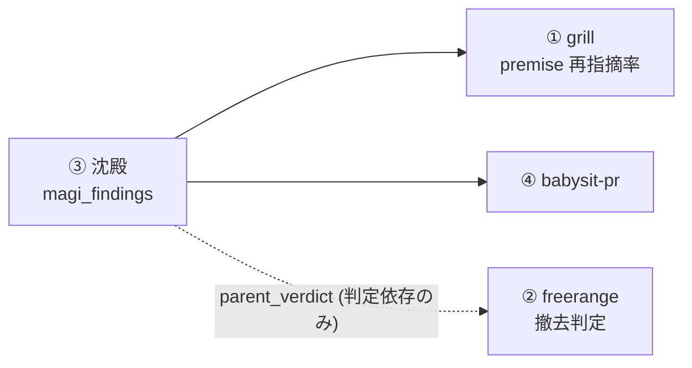

# REVIEW_FLOW_PORT — review flow 4 要素の移植 (gh #233 / coordination epic)

- status: **v0.5 (coordination epic)** — 2026-07-28
- source: https://zenn.dev/kimuchan/articles/bc8e98682f8594 の運用要素の移植
- umbrella: gh #233、関連 #218 / #231。round 1-5 findings: `docs/designs/.dual-magi/REVIEW_FLOW_PORT/`
- **changelog**: v0.5 = R5 8-fix micro-reroll, no new mechanisms; design-done checkpoint。round 5 の 8 findings (r5-1..r5-8) を
  該当 sub-doc に in-place 反映、新機構・新 scope なし。§7 DEFERRED に receipt 永続 chain (r5-6) を追加。
- **changelog**: v0.4 = round 4 の 4/4 REJECT (codex cross-family 込み) 応答。③ の data 層 identity 再設計、④ の green predicate を
  probe P2/P3/P5 実測で全面書換え、② の convergence gate 依存を撤回、① の挿入位置を probe 待ちへ差戻し、受入表を sub-doc §9 への
  pointer 化。

## 1. sub-doc = 実装計画の SoT

| slice | doc | 一言 |
|---|---|---|
| ③ 沈殿 | [01-sedimentation.md](REVIEW_FLOW_PORT/01-sedimentation.md) | magi findings 収穫 → PG → recurrence 提示 |
| ① grill | [02-grill.md](REVIEW_FLOW_PORT/02-grill.md) | ultramagi SKILL.md Phase 0 (premise 実在確認) |
| ④ babysit-pr | [03-babysit-pr.md](REVIEW_FLOW_PORT/03-babysit-pr.md) | PR green 化 loop (reply-only) |
| ② freerange | [04-freerange.md](REVIEW_FLOW_PORT/04-freerange.md) | 指示なし 4 体目 reviewer |

**plateau loop は本 doc でなく unblocked slice の sub-doc 単位**で回す (ultramagi SKILL.md ln113-114「Epic やその umbrella document を
design plateau loop に流すな」)。**本 doc に plateau loop を掛けるのは round 4 が最後**、first unblocked slice = **③**。

### 1.1 state namespace と budget (r4-workflow-5)

dual-magi SKILL.md ln162 (v0.10.1) により state dir は `${doc_dir}/.dual-magi/<doc-stem>/` の per-doc namespace。

- **この campaign (round 1-4 / 本 doc set 全体) の履歴は `docs/designs/.dual-magi/REVIEW_FLOW_PORT/` に残る**。v0.4 の review も
  同 namespace で継続する (SET 単位の履歴)。
- **今後の slice ごとの review は新 namespace で fresh に始める**: `docs/designs/REVIEW_FLOW_PORT/.dual-magi/01-sedimentation/` 等、
  round 1 から、**slice ごとに 12 weighted launches の予算を持つ**。根拠 = ultramagi ln110-115 が epic 分割を義務付けており、
  SKILL.md ln540-544 の anti-reset 条項は**同一 target の再走**を禁じるもので、別 artifact への正当な分割は該当しない。
- 無制限化ではない: **epic 累計 = 4 slice × 12 = 48 を超えたら altitude checkpoint** を回す。
- slice campaign の Step 1 prior-findings load 用に、epic namespace の `round_4.json` を各 slice の新 dir へ
  `round_0_epic_carryover.json` として seed する (r1-r4 の再審を防ぐ)。

## 2. global invariants (全 slice 拘束、sub-doc は上書き不可)

1. **scope = Claude-orchestrated flow v1**。Codex/Kimi flow への展開 (fanout CLI / persona set / manifest capability) は本 epic の
   scope 外、v1 実測後に別 doc。
2. **自動昇格しない**。recurrence → hook/guard/rail の変換は常に人間 + 統括の判断。
3. **測定 data 層は `personal.magi_findings` 1 本**。①②④ の指標は全てここから引く。別 store を作らない。
   `dual-magi-review` SKILL.md への**散文追記**は「magi campaign 本体への変更」に含めない (本体 = fanout CLI / persona set /
   canonical template / fingerprint)。
4. **structural 優先**。structural 化できない拘束は sub-doc の「やらないこと」に *未強制の convention* と明記する。
   強制されていない拘束を安全根拠に使わない。
5. **未実測の CLI flag / file field を設計に書かない**。probe 先行、probe 結果を doc に数値で貼る。probe が **未** の間は、
   それに依存する本文を **「P<N> 待ち (仮説)」と明示**する。**本 invariant を強制する機構は無い (未強制の convention)** —
   v0.3 は 3 箇所でこれを破り、3 箇所とも round 4 で falsify された。
6. **reviewer 自由文 (title/rationale/required_fix) は redact/scrub path を通してから** PG 永続化・public 面への転記を行う。
7. **gh 系 write の安全は skill 自身の境界が担う**。既存 hook (branch_policy_guard / bash_command_guard) は `git commit|push` と
   command shape にのみ効き、`gh` write を守らない。

## 3. slice 順 = ③ → ① → ④ → ② と依存の根拠

- ③ が先頭: ① の効果指標 (premise 再指摘率)、② の撤去指標 (parent_verdict 列)、④ の完了報告に使う telemetry 慣行が全て ③ の
  table に依存する。③ 抜きで ①②④ の成功判定は**計算経路が閉じない**。
- **④→② の依存辺は削除** (r4-workflow-6): 実測で `~/.claude/skills/dual-magi-review` は既に repo への symlink であり、② は既存
  skill の version bump のみ。`install-claude-skills.sh` を要するのは新規 skill を出す ④ 自身だけ。
- **③→② は「着手依存」でなく「判定依存」**: ② は ③ の完了を待たずに着手でき、`parent_verdict` 列が無い間は 04 §5.2 の撤去判定を
  保留する。② を早める方が freerange campaign が早く貯まり、③ の収穫対象と ② の撤去判定の両方が前倒しになる。
  それでも ② を最後に置くのは**統括の注意力が同時 1 slice しか持てない**ため (installer を根拠にしない)。
- ③ の受入は cron soak 3 日を含むので、**③ の gate 通過を待たずに ① の probe / 設計着手は並走してよい** (実装 merge は順序どおり)。

## 4. slice ごとの受入条件 / rollback 境界

**単一の SoT は sub-doc の activation checklist** (01/03 は §9、02/04 は §7)。下表は pointer + gate 項のみを持つ
(二重管理を作らない = r4-workflow-3)。

| slice | acceptance = sub-doc checklist の全項 | gate 項 (これが欠けたら close 不可) | rollback 境界 | #233 |
|---|---|---|---|---|
| ③ | [01](REVIEW_FLOW_PORT/01-sedimentation.md) §9-1..§9-9 | **§9-2** (dryrun 分布を doc に貼付 + doc_slug 再測、migration より前) / **§9-4** (fail-closed の陽性 + 陰性対照) / **§9-5/7** (sidecar 先行 → harvest で parent_verdict 行) / **§9-6** (同 relpath・異 digest → 2 sighting) / **§9-8** (join 非一意 → 無更新 + 非 0 exit) + cron 3 日連続 exit 0 | `046_magi_findings_down.sql` + crontab 行削除。script は corpus から冪等再計算可 | [ ] #233 ③ |
| ① | [02](REVIEW_FLOW_PORT/02-grill.md) §7-1..§7-5 | **§7-1** (P9 完了 = 挿入位置を行番号で確定) / **§7-5** (実走 1 campaign で premise_id + evidence receipt 付き memo) | SKILL.md を直前 tag に revert (PR body に sha 記録) | [ ] #233 ① |
| ④ | [03](REVIEW_FLOW_PORT/03-babysit-pr.md) §9-1..§9-11 | **§9-4/§9-5** (receipt hook の登録 + live sync + drift 沈黙 + receipt/marker fixture) / **§9-6** (CI matcher fixture) / **§9-8** (非空 check-set の PR で実戦 1 回) / **§9-9** (PASS→push が not-green) / **§9-10** (anchor..head の他者 commit で hand-back) / **§9-11** (registry 5 ケース + receipt 不在で no-op) | skill dir + symlink 削除、hooks.json entry 削除 + `~/.claude/pr_receipts/` 掃除。積んだ fix commit は revert 手順を完了報告に添付 | [ ] #233 ④ |
| ② | [04](REVIEW_FLOW_PORT/04-freerange.md) §7-1..§7-6 | **§7-1** (SKILL.md v0.11.0+ に severity 1 文 + Step 4 の sidecar producer 配線) / **§7-5** (freerange campaign 1 本で `reviewer='freerange'` 行 + sidecar → harvest で parent_verdict が自動で入る) / **§7-6** (round 再掲 finding が count=1) | SKILL.md revert | [ ] #233 ② |

probe は各 sub-doc §6/§8 の表が SoT。④ の gate には **P11 / P15** が、① の gate には **P9** が含まれる (§2-5 の probe 先行)。

## 5. activation policy (全 slice 共通)

**`~/.claude/skills/` の symlink は per-skill の手作業**であって自動ではない (実測: harness-* は installed_plugins.json に無く、
Claude 側 install script も test も存在しない。Codex/Kimi 側にのみ `install-codex-skills.sh` + `test_skill_install.sh` がある)。

1. version bump (SKILL.md frontmatter / script header)。
2. 反映確認: **symlink は `readlink -f ~/.claude/skills/<name>` が repo path を指すことを確認**。copy 経路 (AGENTS.md 等) は
   再配布 + md5 突合。cron は `crontab -l` 突合。**hook は symlink 経路を持たない** — `scripts/sync_hooks_to_live.py` で live 反映し
   `scripts/check_hook_wiring_drift.py` の沈黙で確認する (03 §5.1)。
3. discovery smoke は **新 session で測る** (編集した session は旧版を読んでいる)。
   - hook = 入力 fixture + 期待 exit code の test を `tests/` に 1 本追加 (決定的)。
   - skill = (i) 新 session の skill 一覧に出現 (ii) 明示呼出しで SKILL.md が load (iii) version 行一致。
     **「自然発火するか」は smoke でなく初回実戦の観測項目**。
4. rollback: 直前 version の commit sha を PR body に記録。
5. slice 着手時 **pre-flight**: (a) 対応 REFINEMENT memo の `LIVE-DB-UNVERIFIED` 行を全解消 (解消 = 実行 command + 出力抜粋を memo に
   追記)。残件 > 0 なら merge しない、件数を PR 本文に書く。(b) **memo が存在しない slice** (① 導入前に着手する ③) は代替として
   sub-doc §2 の実測表を着手日に再実行する。(c) 当該 sub-doc の probe 表に **未** が残る項目を根拠にした本文がゼロであること。

probe P6 は「installed skill の SHA 突合」(symlink 相手には恒真) を廃し、**「symlink の実在と向き先 + 新 session の skill 一覧への
出現」**に置換する。

## 6. やらないこと (epic level)

- 自動昇格 (recurring → hook の変換)
- magi campaign 本体 (fanout CLI / persona set / canonical template / fingerprint) への変更一切
- Codex/Kimi manifest への skills capability 追加 (v2 で別 doc)
- babysit-pr の auto-resolve / auto-merge / `gh pr ready` (draft→open) / CI・test file 編集 / PUBLIC repo への無人返信
- findings の embedding 類似 dedup (v1 は正準化 hash + title_norm 完全一致)
- grill の live DB 検証 (schema-as-code 参照に限定、`LIVE-DB-UNVERIFIED` mark で slice pre-flight に委譲)
- **⑤ ガイドライン自動同期 (#231) は本 epic の scope 外**
- **gh #233 との差 (r4-workflow-7)**: issue body の item 3 は babysit-pr に「thread の resolve → re-request → 全 green で
  draft→open」を求めているが、**v0.4 はこれを明示的に行わない** (reply-only / `gh pr ready` なし)。**#233 の body は本 doc set に
  superseded される** — plateau 到達後に #233 へ comment し、item 3 の narrow と 4 slice の checkbox 化を行う。

## 7. DEFERRED (v0.3 / v0.4 / v0.5 で採らなかった findings)

| finding | 判断 |
|---|---|
| r3-ops-6 / r3-ops-7(b) / r1-ops-12 残 / r3-adversarial-9・11 | v0.3 の判断を維持 (別表 `magi_finding_sightings` は sighting_key 導入で不要化、worktree file 単位 md5 判定は positive control で実損 0、通知粒度制御と repo allowlist は v2) |
| r4-adversarial-5 残 (source file が消えた行への scrub) | sighting_key upsert で再 harvest 経路は開通。**原本が消えた行だけ**到達不能、`--mode scrub` は v2 |
| r4-adversarial-7 (drop 判定を redactor と独立にする) | v1 は drop 時の stub 行 + `dropped_credential` counter で「無言の穴」を塞ぐに留める。独立検出器 (entropy 等) は v2、P8 の結果次第 |
| r4-adversarial-13 (per-PR 永続 counter) | 03 §10 に **未強制の convention** として降格記載 (DEFERRED の根拠が同梱 `loop` skill の canonical example と矛盾するため)。永続 counter は v2 |
| r4-adversarial-17 (table を別 schema に隔離) | v1 は DDL comment + 01 §10 の未強制 convention 記載に留める。grant 分離は v2 |
| r4-ops-9(d) / r4-ops-11(b) | epic 分割下の sub-doc 粒度は `source_path` 引き当てで代替 (doc_slug は campaign 粒度のまま)。`first_run_id` の FK は張らず列 comment で意図を書く |
| r4-workflow-7(a)(d) | #233 body の Epic 契約形への書換えと anchor link 化は **plateau 到達後**に行う (design が確定する前に tracker を書き換えない) |
| **r5-6** (receipt lineage の永続 append-only chain) | v1 は **creation anchor + in-run push list** に縮約 (03 §5)。append-only chain / ack record / durable ownership 機構 (= 第三者 commit の恒久排除) は **v2**。帰結として「別 agent の commit」と「再起動後の自分の commit」は区別できず、どちらも hand-back に倒れる (安全側) |
| **r5-1 残** (plain `.dual-magi/` 直下 file の doc 帰属復元) | body に exact artifact identity が無い file は `doc_slug=NULL` のまま recurrence 対象外。parent-dir 推測での復元は **採らない** (異 doc を 1 bucket に潰す)。件数は `doc_slug_underivable` で可視化し、必要なら v2 で producer 側に `doc` field を書かせる |
| **r5-3 残** (sidecar 先行時の 0-match) | Step 4 は sidecar を書くだけ。保証と DB 適用は harvester 統合側 (01 §6) に一本化。pending verification の永続 store は **作らない** |
| **dup_flag を recurrence signal に使う案** (統括裁定 2026-07-28 で却下) | 実測: present かつ非 new の 797 行中 positive な dup marker は **47** のみ、explicit nondup 298 / free-text 452 に汚染。signal として成立しないので **採らない**。recurrence は `title_norm` group × distinct `artifact_key` で取る (01 §5)。producer 側に構造化 dup field を書かせる案は v2 |
| **r5-5 残** (marker を書かせる強制機構) | OID 付き marker 文法は契約だが、reviewer に書かせる機構は無い (03 §10 の未強制 convention)。marker 不在 / OID 不一致は `REVIEW_UNRECORDED` で hand-back に倒す |
